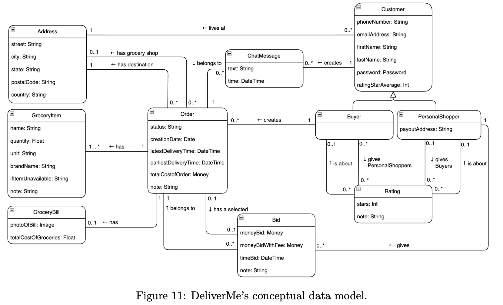
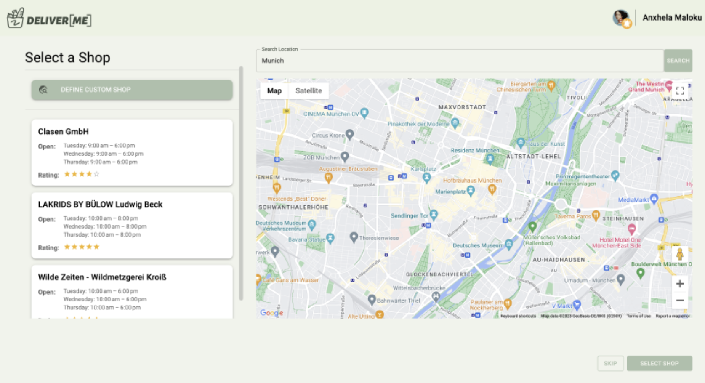
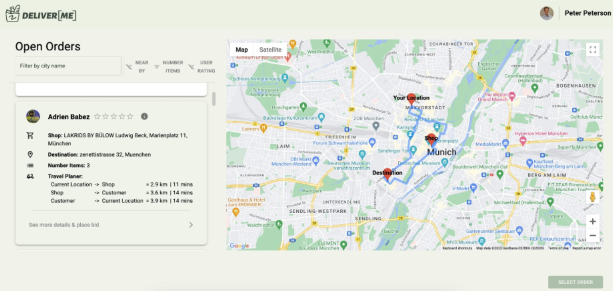
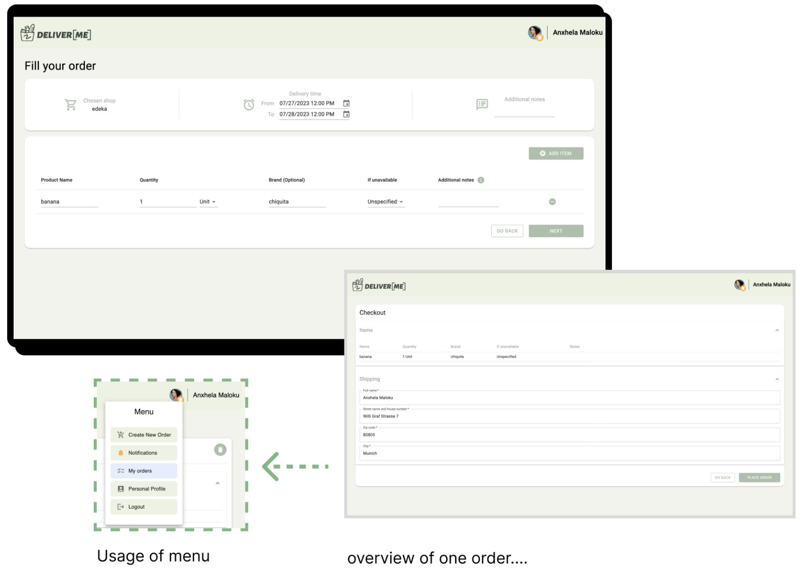
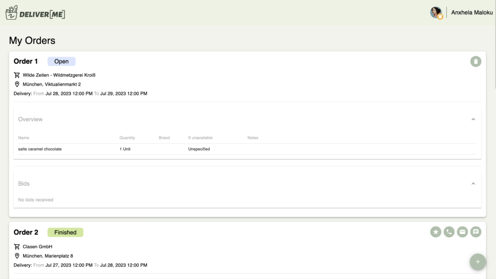
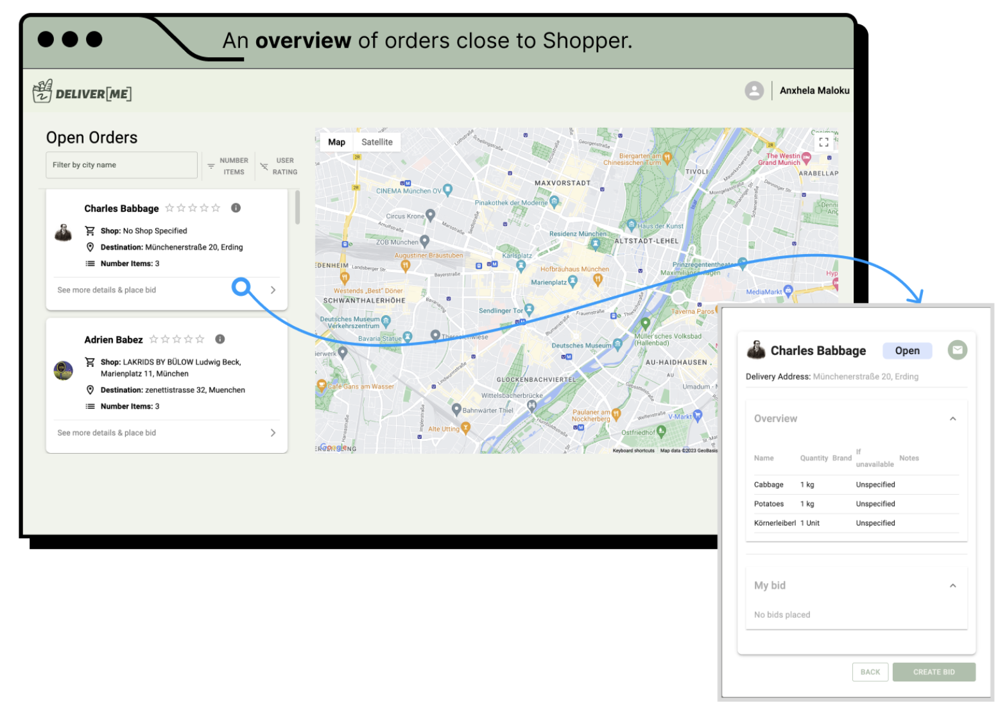
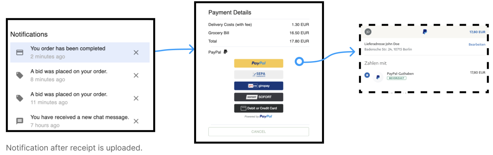
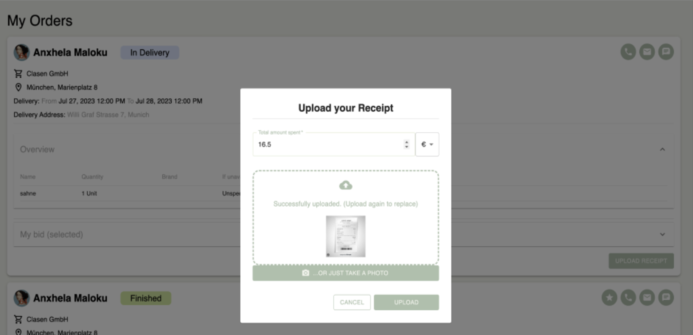
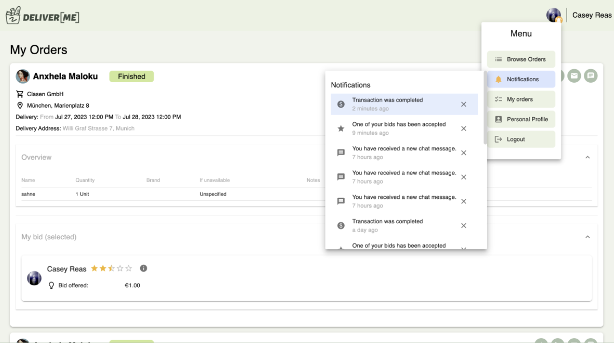
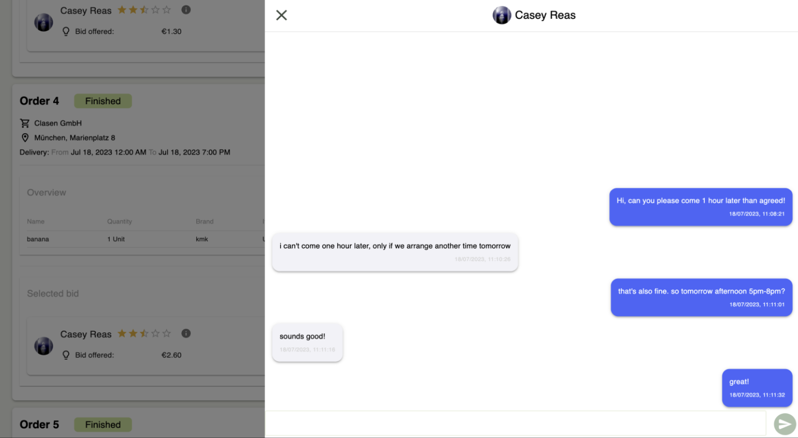

# DeliverMe

## Authors (Team 06):

- Ebin Madan / ge35qiq
- Simon Burmer / ge48naw
- Anxhela Maloku / ge83yuq
- Lukas Rossi / ge93xax

## Development Setup

TLDR: `npm run tldr `
(This will install dependencies and run the compiler, the backend, and the frontend in watch mode.)

### Test accounts

- Buyer:
  - Email: betty.zhang@gmail.com
  - Password: Betty

- Shopper:
  - Email: simon.brumer@gmail.com
  - Password: Simon

- Example PayPal sandbox accounts for paying and receiving money (login to https://www.sandbox.paypal.com/ to see transactions.
  Feel free to use your own sandbox accounts):
    - `sb-47dhwo26079817@personal.example.com` pw: `Vx1/E-#c`
    - `sb-fvfkn26618317@personal.example.com` pw: `7E/rQ?/[`

### Things to do

Whenever pulling a branch, just assume the dependencies have changed and run `npm i` (twice: once in `./.` and
once in `./frontend`).

### Scripts

The backend `package.json` contains two ways of running a dev build.
Either run `start` which will trigger the TS compiler in `prestart` or
use the file watchers `watchCompileTS` for continuous TS compilation and `watchRunNode`
for automatic restarts.

The frontend can simply be run using the `start` script.

### Environment Variables

Note: For ease of use we have provided `.env` files in the repository. This does not reflect
best practice. We have decided for it as it makes setup easier and all secrets used here are of minor value.

We use dotenv. The files `./frontend/.env` and  `./.env` contain the following values:

#### Frontend

| Name                          | Description                                                                                                                     |
|-------------------------------|---------------------------------------------------------------------------------------------------------------------------------|
| HTTPS                         | `true` or `false` depending on if SSL is wanted                                                                                 |
| SSL_CRT_FILE                  | `./.cert/deliver.me.crt` or the desired location of the SSL certificate. (Other values require the backend to be reconfigured.) |
| SSL_KEY_FILE                  | `./.cert/deliver.me.key` or the desired location of the SSL key.                                                                |
| REACT_APP_BACKEND             | The url of the backend. For example:`https://localhost:8443` or `http://localhost:8443` depending on if SSL is used or not      |
| REACT_APP_WEBSOCKET           | The url of the socket. For example:`wss://localhost:8443` or `ws://localhost:8443` depending on if SSL is used or not           |
| REACT_APP_GOOGLE_MAPS_API_KEY | A key for the Google Maps APi                                                                                                   |

#### Backend

| Name              | Description                                                                                                                 |
|-------------------|-----------------------------------------------------------------------------------------------------------------------------|
| MONGO_URL         | The url to connect to MongoDB .                                                                                             |
| JWT_SECRET        | The secret used for signing JWT tokens.                                                                                     |
| https             | Optional: `true` if you want https                                                                                          |
| SSL_CRT_FILE      | Optional: The location of the SSL certificate, e.g., `./.cert/deliver.me.crt`                                               |
| SSL_KEY_FILE      | Optional: The location of the SSL key, e.g., `./.cert/deliver.me.key`                                                       |
| PAYPAL_CLIENT_ID  | The PayPal client id                                                                                                        |
| PAYPAL_APP_SECRET | The PayPal app secret                                                                                                       |
| HOST              | The address of the server                                                                                                   |

### SSL

Both frontend and backend support both SSL and plain http.
If SSL is wanted, place the key and certificate files in `./frontend/.cert` naming them
`deliver.me.crt` and `deliver.me.key` respectively.

If you want to create a locally trusted script for development the following link might prove useful:
https://deliciousbrains.com/ssl-certificate-authority-for-local-https-development/

